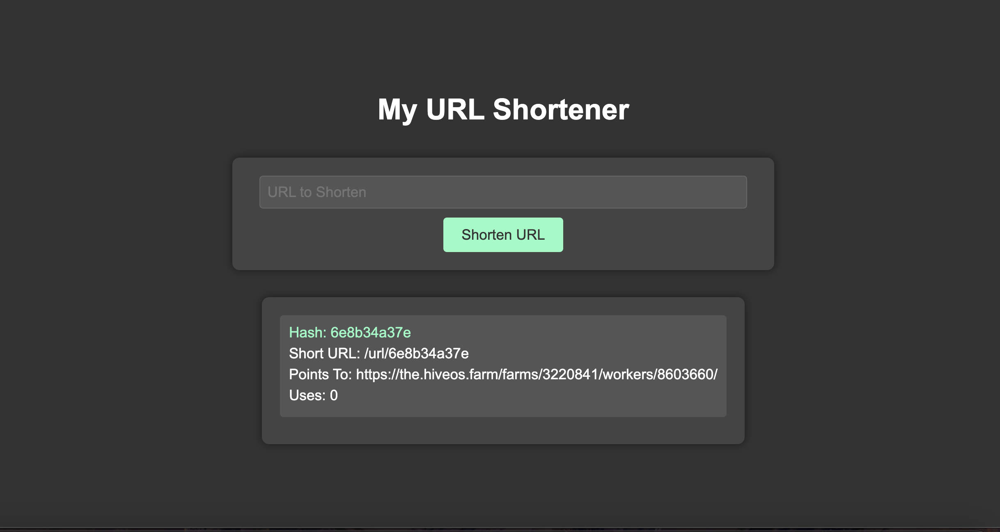

# URL Shortener

## Project Description

URL Shortener is a service built using Django and Django REST Framework. It allows users to create short URLs that redirect to longer URLs, track the number of visits, and provides a simple UI for managing the URLs.

## Installation

1. **Clone the repository:**
   ```bash
   git clone https://github.com/yourusername/url-shortener.git
   cd url-shortener
   ```
2. Create and activate a virtual environment:
```
python -m venv venv
source venv/bin/activate
# On Windows use `venv\Scripts\activate`
```
3. Install the required packages:
```
pip install -r requirements.txt
```
4. Apply migrations:
```
python manage.py migrate
```
5. Run the development server:
```
python manage.py runserver
```

## Usage

### API Endpoints

- **Create Short URL:**
  - **Endpoint:** `/api/create/`
  - **Method:** `POST`
  - **Data:** `{ "url": "http://example.com" }`
  - **Response:** `{ "short_url": "/url/<hash>/" }`

- **Get URL Statistics:**
  - **Endpoint:** `/api/stats/<hash>/`
  - **Method:** `GET`
  - **Response:** `{ "hash": "<hash>", "url": "http://example.com", "visits": 10 }`

### Redirect

- Access a short URL at `/url/<hash>/` to be redirected to the original URL.

### Simple UI

- Visit the home page to see a list of all shortened URLs and their visit counts.

## Contribution

If you would like to contribute to the development of this project, please follow these steps:

1. Fork the repository.
2. Create a new branch (`git checkout -b feature/your-feature`).
3. Make your changes and commit them (`git commit -am 'Add new feature'`).
4. Push your changes to your branch (`git push origin feature/your-feature`).
5. Create a pull request on GitHub.

## Authors

- **Your Name** - [GitHub](https://github.com/oscardkyou)


